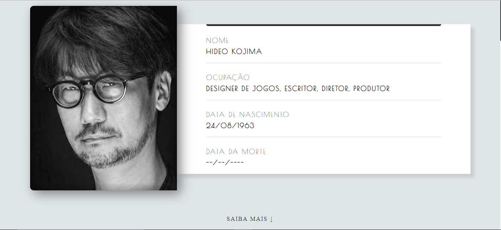

# Hideo Kojima Tribute Page
> Uma página de tributo para Hideo Kojima. Feito como um exercício do curso "PHP do Zero ao Profissional".



## Sobre

Este projeto foi feito somente com fins educativos, qualquer sugestão de melhoria é bem vinda. Então, sinta-se a vontade para enviar sua PR ou publicar um Issue.

## Referencias

- [BuscaBiografias.com](https://www.buscabiografias.com/biografia/verDetalle/10144/Hideo%20Kojima) - Jogos produzidos.
- [Wikipedia](https://pt.wikipedia.org/wiki/Hideo_Kojima) - Data de nascimento e ocupação.
- [Google Images](https://www.google.com/search?q=Steve+Jobs&safe=strict&source=lnms&tbm=isch&sa=X&ved=0ahUKEwjCpJHJh9viAhVzH7kGHaYJDOwQ_AUIECgB#imgrc=M8b19cIwJs8jzM) - Inspiração para layout da introdução.
- [Online Tutorials](https://youtu.be/X6aMWDDJlJg) - Timeline Responsiva.
- [FlatUIColors](https://flatuicolors.com/) - Algumas cores usadas.
- [IMDb](https://www.imdb.com/name/nm0463620/awards) - Prêmios ganhos.

## Licença

Este projeto é licenciado na licença MIT - veja o arquivo [LICENSE.md](LICENSE.md) para detalhes.

## Contribuindo

1. Faça um Fork (https://github.com/doougui/kojima_tribute_page/fork)
2. Clone o repositório (```git clone https://github.com/yourname/kojima_tribute_page```)
3. Crie o branch da sua alteração (```git checkout -b your_feature_name```)
4. Commite as suas mudanças (```git commit -am 'Add some changes'```)
5. Faça um push no branch (```git push origin your_feature_name```)
5. Crie uma nova PR. 