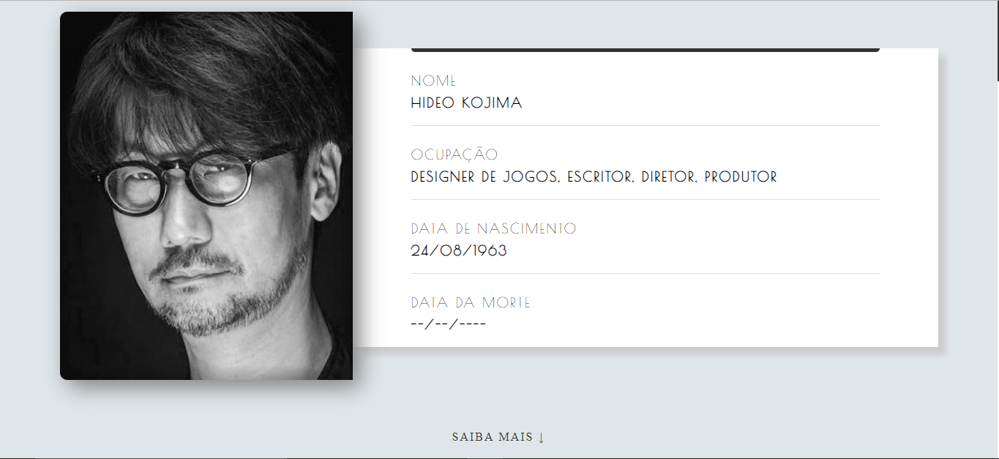

# Hideo Kojima Tribute Page
> A tribute page for Hideo Kojima. Made as a exercise from course "PHP from zero to professional".



## About

This project was made only for educational purposes, any suggestion of improvement is welcome. Then, feel free to submit your PR or publish an Issue.

## Referencias

- [BuscaBiografias.com](https://www.buscabiografias.com/biografia/verDetalle/10144/Hideo%20Kojima) - Games produced.
- [Wikipedia](https://pt.wikipedia.org/wiki/Hideo_Kojima) - Date of birth and occupation.
- [Google Images](https://www.google.com/search?q=Steve+Jobs&safe=strict&source=lnms&tbm=isch&sa=X&ved=0ahUKEwjCpJHJh9viAhVzH7kGHaYJDOwQ_AUIECgB#imgrc=M8b19cIwJs8jzM) - Inspiration for introduction layout.
- [Online Tutorials](https://youtu.be/X6aMWDDJlJg) - Responsive timeline.
- [FlatUIColors](https://flatuicolors.com/) - Some colors used.
- [IMDb](https://www.imdb.com/name/nm0463620/awards) - Won awards.

## License

This project is licensed under the MIT License - see the [LICENSE.md](LICENSE.md) file for details.

## Contributing

1. Fork it (https://github.com/doougui/kojima_tribute_page/fork)
2. Clone repository (```git clone https://github.com/yourname/kojima_tribute_page```)
3. Create your feature branch (```git checkout -b your_feature_name```)
4. Commit your changes (```git commit -am 'Add some changes'```)
5. Push to the branch (```git push origin your_feature_name```)
5. Create a new Pull Request